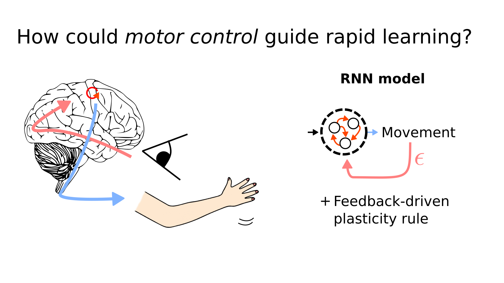

    

  <h1 align="left">Motor control can guide rapid learning through feedback-driven plasticity</h1>

Barbara Feulner, Matthew G. Perich, Lee E. Miller, Claudia Clopath, Juan A. Gallego

## Table of contents

- [Quick start](#quick-start)
- [What's included](#whats-included)
- [Requirements](#requirements)

## Quick start

The main steps of running a full experiment are the following

- Setting up all parameters of the model [code](setup_parameters.py)
- Initial training on random reaches [code](setup_OFC_network.py)
- Adaptation to VR perturbation with feedback-driven plasticity rule [code](adaptation_learning.py)

## What's included

**Toolbox scripts:**

- `dataset.py`: handles everything related to data generation
- `modeldef.py`: defines RNN model 

**Simulation scripts (should be executed in the following order):**

1. `setup_parameters.py` This is used to set all parameters for the experiment. It creates a param.npy file in the respective experiment folder. 
2. `setup_OFC_network.py` This runs the initial training of the model on a constructed random reach dataset.
3. `adaptation_learning.py` This simulates rapid learning by feedback-driven plasticity of the recurrent connections in the RNN.

**Extra:**

* `paper.py` This can be used to automatise experiments.

## Requirements

The original work was using Python 3.7.4 and PyTorch 1.8.1.  
The code here was updated to work with Python 3.11.5 and PyTorch 2.3.1.
